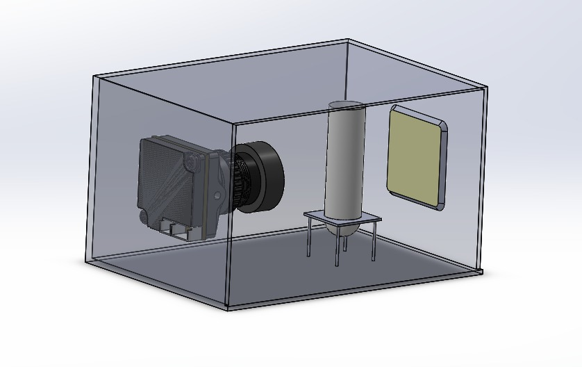

# 🔥 SPARK - Automated Chlorination System

<div align="center">
  
  
*(Replace with actual project banner image)*

[](https://www.python.org/downloads/)
[](https://opencv.org/)
[](LICENSE)
[](https://doi.org/10.5281/zenodo.1234567)

</div>

## 🌟 Introduction
**SPARK** revolutionizes industrial chlorination with a **non-contact automated system** that precisely controls high-concentration chlorine levels (700-2000 ppm) while eliminating manual dosing inefficiencies.

```mermaid
graph LR
    A[Chlorine Sample] --> B(RGB Camera)
    B --> C{AI Model}
    C --> D[Pump Control]
    D --> E[Precise Dosing]
